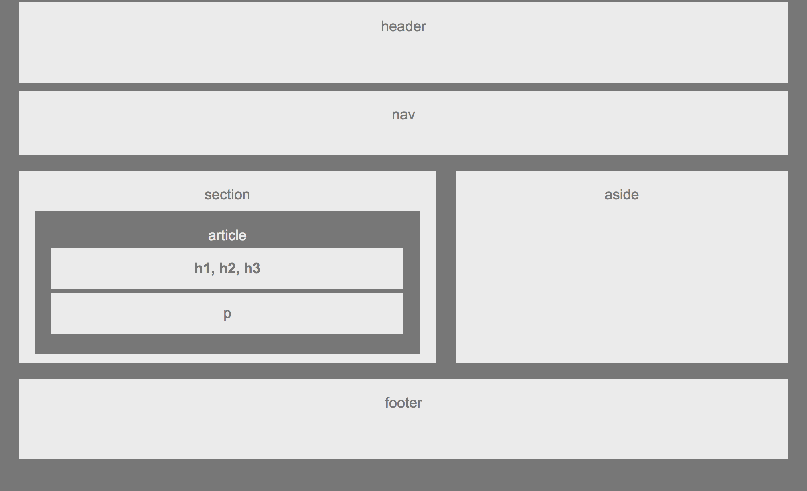

# Building a Wireframe ✅
# Welcome

In this project we will be building a basic wireframe of a web page.

## Overview
Building a basic wireframe for a web page, my wireframe template includes a header, navbar, body and a footer.



### Getting Started
You will need to have your HTML file and your CSS file for styling. 
Here is a code snipet of my index.html:

``` 
 <div class="main-container">

        <header>header</header>

        <div class="nav">nav</div>

        <div class="box-set">
            <section>
                section
                <div class="article">
                    article
                    <div class="article-header">
                        h1, h2, h3
                    </div>
                    <div class="paragraph">p</div>
                </div>
            </section>
            <aside>
                aside
            </aside>
        </div>

        <footer>
            footer
        </footer>
    </div>

```

### Built With
* HTML
* CSS
* [VSC](https) - Visual Studio Code, Editor
* [Github Pages](https) - Deployment

## Authors

* **Maira Jimenez** - *Initial work* - [Mairaaj14](https://github.com/Mairaaj14)


## Acknowledgments

* Jerome Chenette
* Sasha Patsel
* Jimmy Tu
